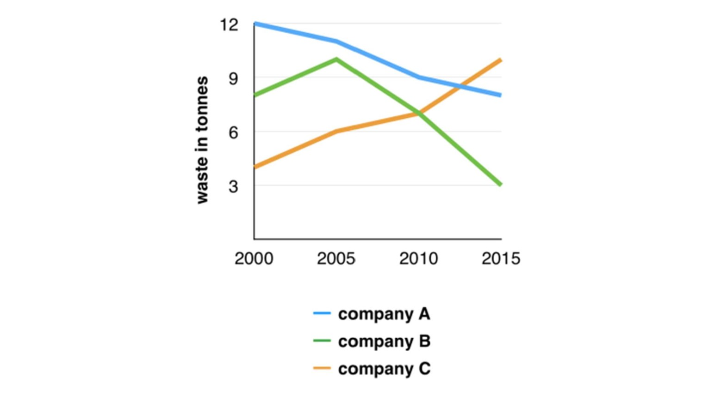

# Topic: The amounts of waste produced by three companies.

**Essay:**

The line graph compares the waste production from three business corporations within fifteen years.
Overall, there was a significant increase in the waste output by company B, while companies C and A saw a dramatic decline between 2000 and 2015.

In the year of 2000, company A released the highest amount of waste (12 tonnes), while company C leaked less than four times that of company A.
From 2000 to 2005, the waste product from companies B and C followed a similar pattern, beginning the period at just 4 and 8 tonnes of waste output and increasing propotionately, 6 and 10 tonnes respectively.
Besides, the figure for company C decreased by 2 tonnes of waste materials.

From 2005 onwards, there was a significant decline in the waste output released by company C, dropping to 8 tonnes in 2015.
Following the trend, the figure for company B shrunk to just 3 tonnes of waste production.
However, company A saw their first-time peaked amount of waste material, at 10 tonnes, at the end of 2015.

